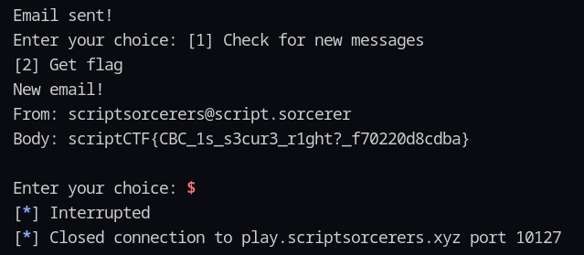

# EaaS - Writeup

**Description:**
_Email as a Service! Have fun..._

---

## Analysis

From the challenge, the service gives us a random email and asks for a password in **hex** format:

```
Welcome to Email as a Service!
Your Email is: tzjnjpghgv@notscript.sorcerer

Enter secure password (in hex):
```

Based on the provided source code, we know that the password is encrypted using **AES-CBC**.

This means we can apply a **bit flipping attack** to manipulate the ciphertext so that the decrypted value becomes what we want.

---

## Approach

Here’s the block layout of the input:

```
 block_1            block_2          block_3            block_4           block_5
aaaaaaaaaaaaaaaa  ,azjnjpghgv@nots  cript.sorcerer,y  ellow__submarine  @acript.sorcerer
```

Our goal is to modify the email so the domain becomes **@script.sorcerer** (a valid domain).

Steps:

- Compute **delta1** to change `,azjnjpghgv@nots` → `,tzjnjpghgv@nots`
- Compute **delta2** to change `@acript.sorcerer` → `@script.sorcerer`

Mathematically:

```
delta1 = ,tzjnjpghgv@nots ⊕ ,azjnjpghgv@nots
delta2 = @script.sorcerer ⊕ @acript.sorcerer
```

---

## Exploitation

The ciphertext provided:

```
enc1 = unhex(460879b6cec8b76a4b040bfefc4d0207)
enc2 = unhex(6c9f6e2e25c6b5e523211e59dc6e38a0)
enc3 = unhex(86c69c30fb50957a4afad0dd74222de8)
enc4 = unhex(86a38e82efde12d56377b091c8f8c495)
enc5 = unhex(01dabb922d574119b99fc3477d3cd1aa)
```

We patch the ciphertext as follows:

```
enc1_edit = enc1 ⊕ delta1
enc4_edit = enc4 ⊕ delta2
```

Then combine the results into the final payload:

```
enc_payload = enc1_edit + enc2 + enc3 + enc4_edit + enc5
```

---

## Result

After submitting the modified ciphertext, the email successfully changes to the valid domain, and the challenge is solved 🎉


